# Introduction

This work is an \*R\* approach to Data Analysis and modeling using
different packages. This time, I will explore the concept of *tidy
data* more in-depth and investigate further into my research questions
defined in milestone 1.

As in milestone 1, I added some explanations for each of the four
research questions. These comments will help me in my future analysis
and for readers to follow up on my work..

## Load libraries, functions, and data files

It is essential to load all the necessary packages at the top of the
script to overview what I will need. the library `datateachr`contains
the data I picked.

    library(datateachr) # <- contain the data I picked!
    library(tidyverse)

    ## ── Attaching packages ─────────────────────────────────────── tidyverse 1.3.1 ──

    ## ✓ ggplot2 3.3.5     ✓ purrr   0.3.4
    ## ✓ tibble  3.1.4     ✓ dplyr   1.0.7
    ## ✓ tidyr   1.1.3     ✓ stringr 1.4.0
    ## ✓ readr   2.0.1     ✓ forcats 0.5.1

    ## ── Conflicts ────────────────────────────────────────── tidyverse_conflicts() ──
    ## x dplyr::filter() masks stats::filter()
    ## x dplyr::lag()    masks stats::lag()

    library(tsibble)

    ## 
    ## Attaching package: 'tsibble'

    ## The following objects are masked from 'package:base':
    ## 
    ##     intersect, setdiff, union

    library(digest)
    library(ggplot2)
    library(hrbrthemes)

    ## NOTE: Either Arial Narrow or Roboto Condensed fonts are required to use these themes.

    ##       Please use hrbrthemes::import_roboto_condensed() to install Roboto Condensed and

    ##       if Arial Narrow is not on your system, please see https://bit.ly/arialnarrow

    library(gtsummary)

# Task 1: Process and summarize my data

Just as a reminder, I’m analyzing the dataset **`vancouver_trees`**:

Acquired courtesy of The City of Vancouver’s Open Data Portal. This data
set has 146,611 rows with 20 variables. This data set has different
categorical values such as `species_name`, `cultivar_name`,
`common_nam`e, and others used for the analysis. The `diameter` values
are the only quantitative data and can be used to do statistical
analysis. The categorical values also can be used to analyze their
frequency. This is a large dataset that could be appropriate to analyze.

    vancouver_trees

    ## # A tibble: 146,611 × 20
    ##    tree_id civic_number std_street    genus_name species_name cultivar_name  
    ##      <dbl>        <dbl> <chr>         <chr>      <chr>        <chr>          
    ##  1  149556          494 W 58TH AV     ULMUS      AMERICANA    BRANDON        
    ##  2  149563          450 W 58TH AV     ZELKOVA    SERRATA      <NA>           
    ##  3  149579         4994 WINDSOR ST    STYRAX     JAPONICA     <NA>           
    ##  4  149590          858 E 39TH AV     FRAXINUS   AMERICANA    AUTUMN APPLAUSE
    ##  5  149604         5032 WINDSOR ST    ACER       CAMPESTRE    <NA>           
    ##  6  149616          585 W 61ST AV     PYRUS      CALLERYANA   CHANTICLEER    
    ##  7  149617         4909 SHERBROOKE ST ACER       PLATANOIDES  COLUMNARE      
    ##  8  149618         4925 SHERBROOKE ST ACER       PLATANOIDES  COLUMNARE      
    ##  9  149619         4969 SHERBROOKE ST ACER       PLATANOIDES  COLUMNARE      
    ## 10  149625          720 E 39TH AV     FRAXINUS   AMERICANA    AUTUMN APPLAUSE
    ## # … with 146,601 more rows, and 14 more variables: common_name <chr>,
    ## #   assigned <chr>, root_barrier <chr>, plant_area <chr>,
    ## #   on_street_block <dbl>, on_street <chr>, neighbourhood_name <chr>,
    ## #   street_side_name <chr>, height_range_id <dbl>, diameter <dbl>, curb <chr>,
    ## #   date_planted <date>, longitude <dbl>, latitude <dbl>

## Research question 1

### Neighborhoods and trees diameter

Within three different neighborhoods, I would like to know which is the
distribution of the diameter. First I selected the three neighborhoods I
will analyze: KITSILANO, MARPOLE, and OAKRIDGE. I used the function
`filter` and I save it in a new tibble called: Kits\_Mar\_Oaktrees.

    (Kits_Mar_Oaktrees<-vancouver_trees %>%
      filter(neighbourhood_name %in% c("KITSILANO", "MARPOLE", "OAKRIDGE")))

    ## # A tibble: 19,264 × 20
    ##    tree_id civic_number std_street genus_name species_name cultivar_name   
    ##      <dbl>        <dbl> <chr>      <chr>      <chr>        <chr>           
    ##  1  149556          494 W 58TH AV  ULMUS      AMERICANA    BRANDON         
    ##  2  149563          450 W 58TH AV  ZELKOVA    SERRATA      <NA>            
    ##  3  149616          585 W 61ST AV  PYRUS      CALLERYANA   CHANTICLEER     
    ##  4  149640         6968 SELKIRK ST ACER       PLATANOIDES  COLUMNARE       
    ##  5  149683         7011 SELKIRK ST ACER       PLATANOIDES  COLUMNARE       
    ##  6  149684         1223 W 54TH AV  ACER       PLATANOIDES  COLUMNARE       
    ##  7  149694         1292 W 49TH AV  ACER       PLATANOIDES  COLUMNARE       
    ##  8  155373         1900 CYPRESS ST PRUNUS     CERASIFERA   NIGRA           
    ##  9  155413         2485 W BROADWAY ULMUS      AMERICANA    BRANDON         
    ## 10  155445         2408 W 13TH AV  ACER       FREEMANI   X SCARLET SENTINEL
    ## # … with 19,254 more rows, and 14 more variables: common_name <chr>,
    ## #   assigned <chr>, root_barrier <chr>, plant_area <chr>,
    ## #   on_street_block <dbl>, on_street <chr>, neighbourhood_name <chr>,
    ## #   street_side_name <chr>, height_range_id <dbl>, diameter <dbl>, curb <chr>,
    ## #   date_planted <date>, longitude <dbl>, latitude <dbl>

After this, I compute the number of observations for each neighbourhood
using the function `summarise`. The output shows that in `Kitsilano` are
8,115 trees, in `Marpole` 6,353 and in `Oakridge` 4,796.

    number_observations <- Kits_Mar_Oaktrees %>%
        group_by(neighbourhood_name) %>%
        summarise(Count = n())

    print(number_observations)

    ## # A tibble: 3 × 2
    ##   neighbourhood_name Count
    ##   <chr>              <int>
    ## 1 KITSILANO           8115
    ## 2 MARPOLE             6353
    ## 3 OAKRIDGE            4796

Since I would like to know which if the distribution of the diameter
within three different neighborhoods, I create 3 histograms (one per
neighborhood), with each histogram having different sized bins. I’m only
interested in the Genus `ACER`.

For picking the best, I investigated that the best # bins is calculated
by knowing the max and min values and the total number of the data
points:

**Number of bins = square root of the # of data points**

**Bin width = (Max-Min) ÷ Number of bins**

### Kitsilano Neighborhood

First I filtered the neighborhood of interest, as well as ACER genus.
And I get a new tibble of 2,211 values.

    Kitsilano_trees<-vancouver_trees %>%
      filter(neighbourhood_name %in% ("KITSILANO") & genus_name %in%  ("ACER"))
    print(Kitsilano_trees)

    ## # A tibble: 2,211 × 20
    ##    tree_id civic_number std_street genus_name species_name cultivar_name   
    ##      <dbl>        <dbl> <chr>      <chr>      <chr>        <chr>           
    ##  1  155445         2408 W 13TH AV  ACER       FREEMANI   X SCARLET SENTINEL
    ##  2  155446         2246 W 15TH AV  ACER       RUBRUM       KARPICK         
    ##  3  156390         2375 W 10TH AV  ACER       CAMPESTRE    <NA>            
    ##  4  156487         2295 W 6TH AV   ACER       PLATANOIDES  GLOBOSUM        
    ##  5  156489         2050 VINE ST    ACER       CAMPESTRE    <NA>            
    ##  6  156493         2091 VINE ST    ACER       PLATANOIDES  GLOBOSUM        
    ##  7  156495         2186 VINE ST    ACER       PLATANOIDES  GLOBOSUM        
    ##  8  156496         2198 VINE ST    ACER       CAMPESTRE    <NA>            
    ##  9  156497         2294 W 5TH AV   ACER       CAMPESTRE    <NA>            
    ## 10  156882         2347 W 10TH AV  ACER       CAMPESTRE    <NA>            
    ## # … with 2,201 more rows, and 14 more variables: common_name <chr>,
    ## #   assigned <chr>, root_barrier <chr>, plant_area <chr>,
    ## #   on_street_block <dbl>, on_street <chr>, neighbourhood_name <chr>,
    ## #   street_side_name <chr>, height_range_id <dbl>, diameter <dbl>, curb <chr>,
    ## #   date_planted <date>, longitude <dbl>, latitude <dbl>

I used `max`and `min`functions to get those values.

    max(Kitsilano_trees$diameter)

    ## [1] 317

    min(Kitsilano_trees$diameter)

    ## [1] 0

And then, I calculate the Bin width:

**Number of bins = square root of the # of data points –>**

    (number_of_bins<- sqrt(2211))

    ## [1] 47.02127

**Bin width = (Max-Min) ÷ Number of bins**

    (Bin_width<- (317-0)/47)

    ## [1] 6.744681

I started using this Bin width, and added two more just to compare and
do a final choose.

In this code, I also make the y <u>**axe logarithmic**</u> to have a
better visualization of the data. In general, with this graph we can see
that there is a high density of trees with a diameter less than 50 in.

    Kitsilano_trees %>% 
    ggplot(aes(x=diameter)) +
      geom_histogram(binwidth=7, fill="#69b3a2", color="#e9ecef", alpha=0.9) + xlim(0,320)+
        ggtitle("Bin width = 7, Kitsilano") +
        theme_ipsum() +
        theme(
          plot.title = element_text(size=15))+scale_y_log10()

    ## Warning: Transformation introduced infinite values in continuous y-axis

    ## Warning: Removed 39 rows containing missing values (geom_bar).

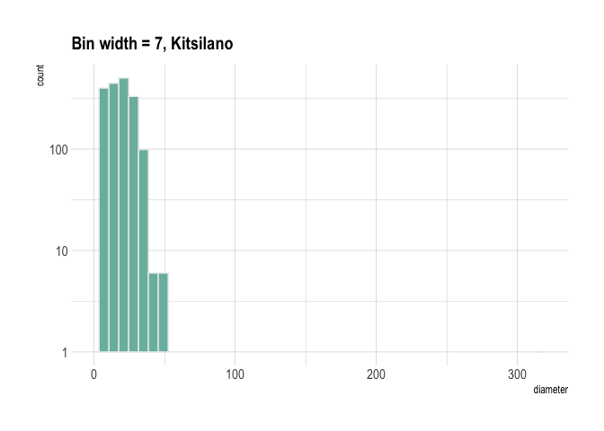

I changed the bin width to 2 and we can see a better distribution of the
values.

    Kitsilano_trees %>% 
    ggplot(aes(x=diameter)) +
      geom_histogram(binwidth=2, fill="#69b3a2", color="#e9ecef", alpha=0.9) + xlim(0,320)+
        ggtitle("Bin size = 2, Kitsilano") +
        theme_ipsum() +
        theme(
          plot.title = element_text(size=15))+scale_y_log10()

    ## Warning: Transformation introduced infinite values in continuous y-axis

    ## Warning: Removed 137 rows containing missing values (geom_bar).

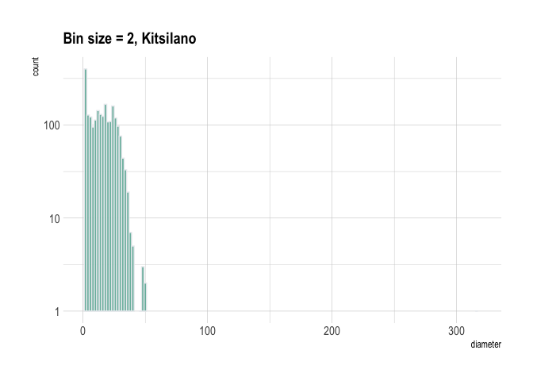

And finally I use a bin width of 20.

    Kitsilano_trees %>% 
    ggplot(aes(x=diameter)) +
      geom_histogram(binwidth=20, fill="#69b3a2", color="#e9ecef", alpha=0.9) + xlim(0,320)+
        ggtitle("Bin size = 20, Kitsilano") +
        theme_ipsum() +
        theme(
          plot.title = element_text(size=15))+ scale_y_log10()

    ## Warning: Transformation introduced infinite values in continuous y-axis

    ## Warning: Removed 14 rows containing missing values (geom_bar).

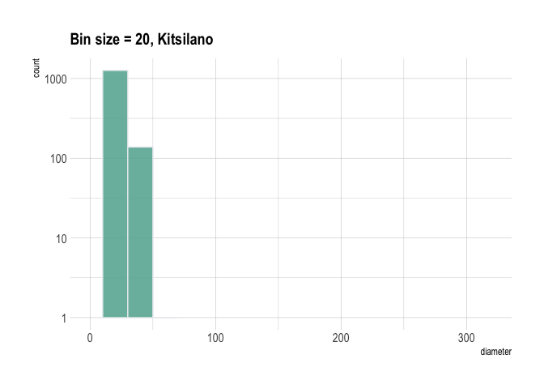

The bin width (and thus the number of categories or ranges) affects the
ability of a histogram to identify local regions of higher incidence. If
it is too large, we will not get enough differentiation. If it is too
small, the data cannot be grouped.

Even though bin width 2 shows more categories, I think the best is bin
width 7. A good bin width will usually show a recognizable normal
probability distribution curve unless the data is multi-modal.

#### Strathcona Neighborhood

The second neighborhood is Strathcona. I follow the same path as in
Kitsilano. First I created a new tibble with the `filter`function:

    (STRATHCONA_trees<-vancouver_trees %>%
      filter(neighbourhood_name %in% ("STRATHCONA") & genus_name %in% ("ACER")))

    ## # A tibble: 536 × 20
    ##    tree_id civic_number std_street  genus_name species_name cultivar_name
    ##      <dbl>        <dbl> <chr>       <chr>      <chr>        <chr>        
    ##  1  157725          920 STATION ST  ACER       PLATANOIDES  <NA>         
    ##  2  157737          739 CAMPBELL AV ACER       CAMPESTRE    <NA>         
    ##  3  157738          814 UNION ST    ACER       CAMPESTRE    <NA>         
    ##  4  157746          868 UNION ST    ACER       CAMPESTRE    <NA>         
    ##  5  157762          886 UNION ST    ACER       CAMPESTRE    <NA>         
    ##  6  157772          503 E PENDER ST ACER       RUBRUM       BOWHALL      
    ##  7  157797          603 RAYMUR AV   ACER       CAMPESTRE    <NA>         
    ##  8  157885          439 HEATLEY AV  ACER       PLATANOIDES  GLOBOSUM     
    ##  9  157898          414 CAMPBELL AV ACER       RUBRUM       BOWHALL      
    ## 10  157899          500 CAMPBELL AV ACER       RUBRUM       BOWHALL      
    ## # … with 526 more rows, and 14 more variables: common_name <chr>,
    ## #   assigned <chr>, root_barrier <chr>, plant_area <chr>,
    ## #   on_street_block <dbl>, on_street <chr>, neighbourhood_name <chr>,
    ## #   street_side_name <chr>, height_range_id <dbl>, diameter <dbl>, curb <chr>,
    ## #   date_planted <date>, longitude <dbl>, latitude <dbl>

I used `max`and `min`functions to get those values.

    max(STRATHCONA_trees$diameter)

    ## [1] 48

    min(STRATHCONA_trees$diameter)

    ## [1] 1

And then, I calculate the Bin width:

**Number of bins = square root of the # of data points –>**

    (number_of_bins<- sqrt(536))

    ## [1] 23.15167

**Bin width = (Max-Min) ÷ Number of bins**

    (Bin_width<- (48-1)/23)

    ## [1] 2.043478

I started using this Bin width, and added two more just to compare and
do a final choose. (I didn’t add changed the y axe to logarithmic but I
did change the color).

    STRATHCONA_trees %>% 
    ggplot(aes(x=diameter)) +
      geom_histogram(binwidth=2, fill="#de73cc", color="#e9ecef", alpha=0.9) + xlim(0,50)+
        ggtitle("Bin size = 2, STRATHCONA") +
        theme_ipsum() +
        theme(
          plot.title = element_text(size=15))

    ## Warning: Removed 2 rows containing missing values (geom_bar).

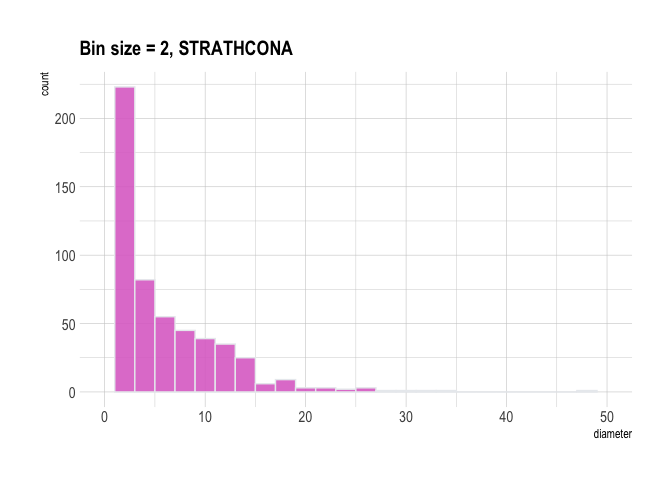

    STRATHCONA_trees %>% 
    ggplot(aes(x=diameter)) +
      geom_histogram(binwidth=5, fill="#de73cc", color="#e9ecef", alpha=0.9) + xlim(0,50)+
        ggtitle("Bin size = 5, STRATHCONA") +
        theme_ipsum() +
        theme(
          plot.title = element_text(size=15))

    ## Warning: Removed 2 rows containing missing values (geom_bar).

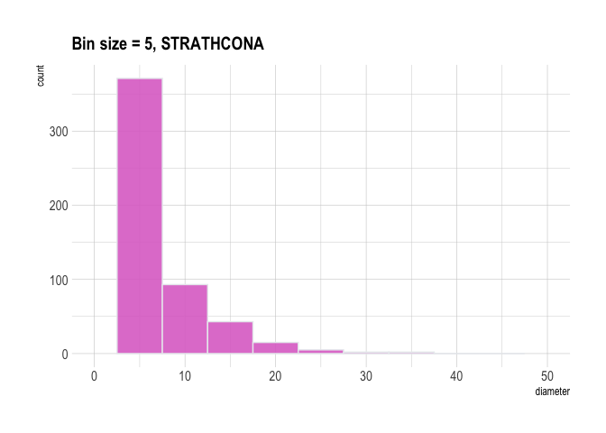

And finally, using bid width of 1

    STRATHCONA_trees %>% 
    ggplot(aes(x=diameter)) +
      geom_histogram(binwidth=1, fill="#de73cc", color="#e9ecef", alpha=0.9) + xlim(0,50)+
        ggtitle("Bin size = 1, STRATHCONA") +
        theme_ipsum() +
        theme(
          plot.title = element_text(size=15))

    ## Warning: Removed 2 rows containing missing values (geom_bar).

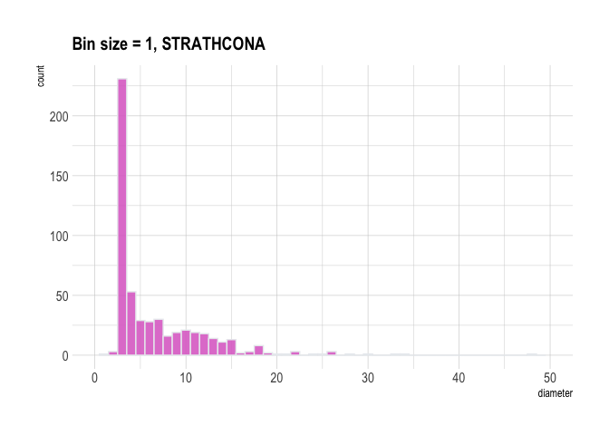

The bin width 5 was too large, and we will not get enough
differentiation. On the other hand, the bin width 1 is too small, and
the data cannot be grouped. The best one is bin width 2.

#### Hastings-sunrise

The last neighborhood is Hastings-sunrise.

    (Hastings_trees<-vancouver_trees %>%
      filter(neighbourhood_name %in% ("HASTINGS-SUNRISE") & genus_name %in% ("ACER")))

    ## # A tibble: 2,508 × 20
    ##    tree_id civic_number std_street  genus_name species_name cultivar_name 
    ##      <dbl>        <dbl> <chr>       <chr>      <chr>        <chr>         
    ##  1  155681         2731 E 2ND AV    ACER       CAMPESTRE    <NA>          
    ##  2  155827         2796 ADANAC ST   ACER       PLATANOIDES  <NA>          
    ##  3  155828         2796 ADANAC ST   ACER       PLATANOIDES  GLOBOSUM      
    ##  4  155830         2795 VENABLES ST ACER       PLATANOIDES  GLOBOSUM      
    ##  5  155832         2811 VENABLES ST ACER       PLATANOIDES  GLOBOSUM      
    ##  6  155833         2811 VENABLES ST ACER       PLATANOIDES  GREEN MOUNTAIN
    ##  7  155836         2806 ADANAC ST   ACER       PLATANOIDES  GLOBOSUM      
    ##  8  155844         3095 E 5TH AV    ACER       PLATANOIDES  GREEN MOUNTAIN
    ##  9  155845         3095 E 5TH AV    ACER       PLATANOIDES  GREEN MOUNTAIN
    ## 10  155846         3096 E 4TH AV    ACER       PLATANOIDES  GREEN MOUNTAIN
    ## # … with 2,498 more rows, and 14 more variables: common_name <chr>,
    ## #   assigned <chr>, root_barrier <chr>, plant_area <chr>,
    ## #   on_street_block <dbl>, on_street <chr>, neighbourhood_name <chr>,
    ## #   street_side_name <chr>, height_range_id <dbl>, diameter <dbl>, curb <chr>,
    ## #   date_planted <date>, longitude <dbl>, latitude <dbl>

I used `max`and `min`functions to get those values.

    max(Hastings_trees$diameter)

    ## [1] 56

    min(Hastings_trees$diameter)

    ## [1] 2

And then, I calculate the Bin width:

**Number of bins = square root of the # of data points –>**

    (number_of_bins<- sqrt(2508))

    ## [1] 50.07994

**Bin width = (Max-Min) ÷ Number of bins**

    (Bin_width<- (56-2)/50)

    ## [1] 1.08

I started using this Bin width, and added two more just to compare and
do a final choose. I also changed the y axe to logarithmic and I also
changed the color.

    Hastings_trees %>% 
    ggplot(aes(x=diameter)) +
      geom_histogram(binwidth=1, fill="#3f0ec7", color="#e9ecef", alpha=0.9) + xlim(0,50)+
        ggtitle("Bin size = 1, HASTINGS") +
        theme_ipsum() +
        theme(
          plot.title = element_text(size=15))+scale_y_log10()

    ## Warning: Removed 7 rows containing non-finite values (stat_bin).

    ## Warning: Transformation introduced infinite values in continuous y-axis

    ## Warning: Removed 10 rows containing missing values (geom_bar).

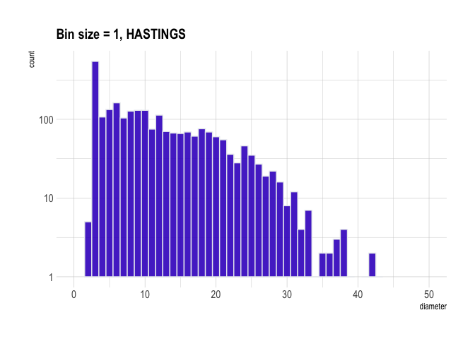

    Hastings_trees %>% 
    ggplot(aes(x=diameter)) +
      geom_histogram(binwidth=3, fill="#3f0ec7", color="#e9ecef", alpha=0.9) + xlim(0,50)+
        ggtitle("Bin size = 3, HASTINGS") +
        theme_ipsum() +
        theme(
          plot.title = element_text(size=15))+scale_y_log10()

    ## Warning: Removed 7 rows containing non-finite values (stat_bin).

    ## Warning: Transformation introduced infinite values in continuous y-axis

    ## Warning: Removed 4 rows containing missing values (geom_bar).

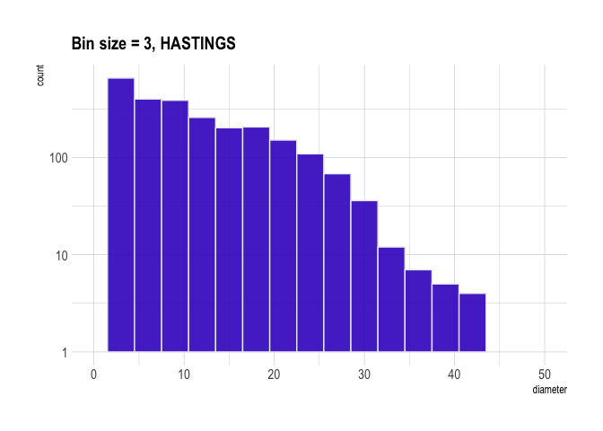

I thought this width was too large, so I change it to 2:

    Hastings_trees %>% 
    ggplot(aes(x=diameter)) +
      geom_histogram(binwidth=2, fill="#3f0ec7", color="#e9ecef", alpha=0.9) + xlim(0,50)+
        ggtitle("Bin size = 2, HASTINGS") +
        theme_ipsum() +
        theme(
          plot.title = element_text(size=15))+scale_y_log10()

    ## Warning: Removed 7 rows containing non-finite values (stat_bin).

    ## Warning: Transformation introduced infinite values in continuous y-axis

    ## Warning: Removed 6 rows containing missing values (geom_bar).

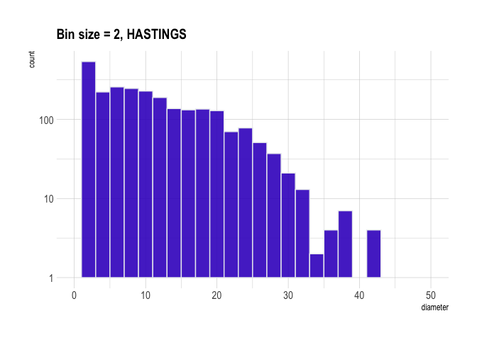

In fact, I think the best is width 1. The other two were too large, and
we will not get enough differentiation.

## Research question 2

Within the ACER genus, I would like to know if there is any relationship
between the species and the diameter? And also if there is a
relationship with the fact that some trees have a root barrier.

Perhaps some species of trees typically have a larger diameter. Since I
only focused on STRATHCONA Neighborhood, I used the tibble
STRATHCONA\_trees I created in Research question 1.

First, I calculated some summary statistics regarding the root barrier.
I used the function `tbl_summary`, within this table we can see that in
most of the cases the trees don’t need a root barrier. Perhaps, it would
be a good idea to analyze more this part.

    STRATHCONA_trees %>% tbl_summary(by=root_barrier, include = species_name) %>%   modify_spanning_header(c("stat_1", "stat_2") ~ "**Root barrier (Y=Yes & N=No)**")

<table class="gt_table">
  
  <thead class="gt_col_headings">
    <tr>
      <th class="gt_col_heading gt_columns_bottom_border gt_left" rowspan="2" colspan="1"><strong>Characteristic</strong></th>
      <th class="gt_center gt_columns_top_border gt_column_spanner_outer" rowspan="1" colspan="2">
        <strong>Root barrier (Y=Yes &amp; N=No)</strong>
      </th>
    </tr>
    <tr>
      <th class="gt_col_heading gt_columns_bottom_border gt_center" rowspan="1" colspan="1"><strong>N</strong>, N = 4791</th>
      <th class="gt_col_heading gt_columns_bottom_border gt_center" rowspan="1" colspan="1"><strong>Y</strong>, N = 571</th>
    </tr>
  </thead>
  <tbody class="gt_table_body">
    <tr><td class="gt_row gt_left">species_name</td>
<td class="gt_row gt_center"></td>
<td class="gt_row gt_center"></td></tr>
    <tr><td class="gt_row gt_left" style="text-align: left; text-indent: 10px;">CAMPESTRE</td>
<td class="gt_row gt_center">47 (9.8%)</td>
<td class="gt_row gt_center">2 (3.5%)</td></tr>
    <tr><td class="gt_row gt_left" style="text-align: left; text-indent: 10px;">CAPPADOCICUM</td>
<td class="gt_row gt_center">1 (0.2%)</td>
<td class="gt_row gt_center">1 (1.8%)</td></tr>
    <tr><td class="gt_row gt_left" style="text-align: left; text-indent: 10px;">CIRCINATUM</td>
<td class="gt_row gt_center">2 (0.4%)</td>
<td class="gt_row gt_center">0 (0%)</td></tr>
    <tr><td class="gt_row gt_left" style="text-align: left; text-indent: 10px;">FREEMANI   X</td>
<td class="gt_row gt_center">33 (6.9%)</td>
<td class="gt_row gt_center">23 (40%)</td></tr>
    <tr><td class="gt_row gt_left" style="text-align: left; text-indent: 10px;">GINNALA</td>
<td class="gt_row gt_center">2 (0.4%)</td>
<td class="gt_row gt_center">0 (0%)</td></tr>
    <tr><td class="gt_row gt_left" style="text-align: left; text-indent: 10px;">GRISEUM</td>
<td class="gt_row gt_center">3 (0.6%)</td>
<td class="gt_row gt_center">0 (0%)</td></tr>
    <tr><td class="gt_row gt_left" style="text-align: left; text-indent: 10px;">MACROPHYLLUM</td>
<td class="gt_row gt_center">8 (1.7%)</td>
<td class="gt_row gt_center">0 (0%)</td></tr>
    <tr><td class="gt_row gt_left" style="text-align: left; text-indent: 10px;">NEGUNDO</td>
<td class="gt_row gt_center">1 (0.2%)</td>
<td class="gt_row gt_center">0 (0%)</td></tr>
    <tr><td class="gt_row gt_left" style="text-align: left; text-indent: 10px;">PALMATUM</td>
<td class="gt_row gt_center">5 (1.0%)</td>
<td class="gt_row gt_center">0 (0%)</td></tr>
    <tr><td class="gt_row gt_left" style="text-align: left; text-indent: 10px;">PLATANOIDES</td>
<td class="gt_row gt_center">121 (25%)</td>
<td class="gt_row gt_center">4 (7.0%)</td></tr>
    <tr><td class="gt_row gt_left" style="text-align: left; text-indent: 10px;">PSEUDOPLATANUS</td>
<td class="gt_row gt_center">17 (3.5%)</td>
<td class="gt_row gt_center">0 (0%)</td></tr>
    <tr><td class="gt_row gt_left" style="text-align: left; text-indent: 10px;">RUBRUM</td>
<td class="gt_row gt_center">167 (35%)</td>
<td class="gt_row gt_center">27 (47%)</td></tr>
    <tr><td class="gt_row gt_left" style="text-align: left; text-indent: 10px;">SPECIES</td>
<td class="gt_row gt_center">7 (1.5%)</td>
<td class="gt_row gt_center">0 (0%)</td></tr>
    <tr><td class="gt_row gt_left" style="text-align: left; text-indent: 10px;">TRUNCATUM</td>
<td class="gt_row gt_center">65 (14%)</td>
<td class="gt_row gt_center">0 (0%)</td></tr>
  </tbody>
  
  <tfoot>
    <tr class="gt_footnotes">
      <td colspan="3">
        

          
            <em>1</em>
          
           
          n (%)
           
        

      </td>
    </tr>
  </tfoot>
</table>

    summary(STRATHCONA_trees$diameter)

    ##    Min. 1st Qu.  Median    Mean 3rd Qu.    Max. 
    ##   1.000   3.000   4.000   6.736   9.000  48.000

Moreover, I used other functions to analyze better the diameter within
the species using the function `tapply` to apply a function over a
ragged array, and in this case, I got the mean of the diameter values
for each species:

    tapply(STRATHCONA_trees$diameter, STRATHCONA_trees$species_name, mean)

    ##      CAMPESTRE   CAPPADOCICUM     CIRCINATUM   FREEMANI   X        GINNALA 
    ##       6.076531       5.000000       7.000000       4.950893       3.000000 
    ##        GRISEUM   MACROPHYLLUM        NEGUNDO       PALMATUM    PLATANOIDES 
    ##       4.666667      20.750000      14.000000       3.000000       8.930800 
    ## PSEUDOPLATANUS         RUBRUM        SPECIES      TRUNCATUM 
    ##      14.558824       5.861082       9.000000       3.576923

And also I get the median:

    tapply(STRATHCONA_trees$diameter, STRATHCONA_trees$species_name, median)

    ##      CAMPESTRE   CAPPADOCICUM     CIRCINATUM   FREEMANI   X        GINNALA 
    ##           6.00           5.00           7.00           3.00           3.00 
    ##        GRISEUM   MACROPHYLLUM        NEGUNDO       PALMATUM    PLATANOIDES 
    ##           3.00          13.75          14.00           3.00           7.50 
    ## PSEUDOPLATANUS         RUBRUM        SPECIES      TRUNCATUM 
    ##          14.00           3.00           6.00           3.00

Moreover, I create a graph out of summarized variables that has at least
two geom layers and I customized the alpha transparency.

In this case I choose the `geom_boxplot` and `geom_jitter`, this is a
way to visualize if there is a relationship between the species and the
diameter. What I can see is that there is not a specific relationship,
perhaps another variable that I should consider is the age of each tree.

    STRATHCONA_trees %>% ggplot(aes(diameter,species_name))+ geom_boxplot()+ geom_jitter (alpha=0.2)

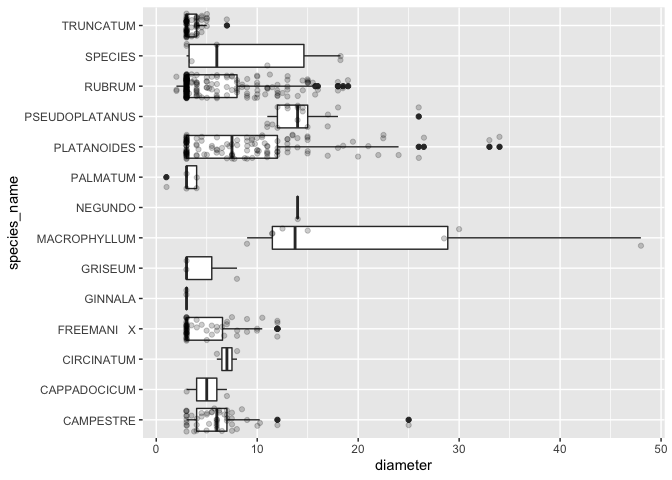

I think this is an excellent research question to go further into the
analysis.

## Research question 3

Considering the results from `Research question 2,` I choose three
`species_names` and I analyze the relationship between the `diameter`and
the `date_planted`. The question I would like to answer is: can I find
any correlations between these two values? I hypothesize that if the
trees are older, the diameter would be larger.

The format of the values from the `date_planted`variable is &lt;date>
year-day-month. Nevertheless, I found it is more convenient to change it
to a “year month” format. We really don’t need the day. For this, I use
the function `yearmonth`:

    Strathcona_dates <- STRATHCONA_trees %>%
       mutate(date_planted = yearmonth(date_planted))
    head(Strathcona_dates)

    ## # A tibble: 6 × 20
    ##   tree_id civic_number std_street  genus_name species_name cultivar_name
    ##     <dbl>        <dbl> <chr>       <chr>      <chr>        <chr>        
    ## 1  157725          920 STATION ST  ACER       PLATANOIDES  <NA>         
    ## 2  157737          739 CAMPBELL AV ACER       CAMPESTRE    <NA>         
    ## 3  157738          814 UNION ST    ACER       CAMPESTRE    <NA>         
    ## 4  157746          868 UNION ST    ACER       CAMPESTRE    <NA>         
    ## 5  157762          886 UNION ST    ACER       CAMPESTRE    <NA>         
    ## 6  157772          503 E PENDER ST ACER       RUBRUM       BOWHALL      
    ## # … with 14 more variables: common_name <chr>, assigned <chr>,
    ## #   root_barrier <chr>, plant_area <chr>, on_street_block <dbl>,
    ## #   on_street <chr>, neighbourhood_name <chr>, street_side_name <chr>,
    ## #   height_range_id <dbl>, diameter <dbl>, curb <chr>, date_planted <mth>,
    ## #   longitude <dbl>, latitude <dbl>

Unfortunately, if we consider the month, we are going to have many
values. For this reason I separate the Year and the Month using the
factor `separate:`

    (Strathcona_years <- Strathcona_dates%>% 
      separate(date_planted, into = c("Year", "Month"), sep=" "))

    ## # A tibble: 536 × 21
    ##    tree_id civic_number std_street  genus_name species_name cultivar_name
    ##      <dbl>        <dbl> <chr>       <chr>      <chr>        <chr>        
    ##  1  157725          920 STATION ST  ACER       PLATANOIDES  <NA>         
    ##  2  157737          739 CAMPBELL AV ACER       CAMPESTRE    <NA>         
    ##  3  157738          814 UNION ST    ACER       CAMPESTRE    <NA>         
    ##  4  157746          868 UNION ST    ACER       CAMPESTRE    <NA>         
    ##  5  157762          886 UNION ST    ACER       CAMPESTRE    <NA>         
    ##  6  157772          503 E PENDER ST ACER       RUBRUM       BOWHALL      
    ##  7  157797          603 RAYMUR AV   ACER       CAMPESTRE    <NA>         
    ##  8  157885          439 HEATLEY AV  ACER       PLATANOIDES  GLOBOSUM     
    ##  9  157898          414 CAMPBELL AV ACER       RUBRUM       BOWHALL      
    ## 10  157899          500 CAMPBELL AV ACER       RUBRUM       BOWHALL      
    ## # … with 526 more rows, and 15 more variables: common_name <chr>,
    ## #   assigned <chr>, root_barrier <chr>, plant_area <chr>,
    ## #   on_street_block <dbl>, on_street <chr>, neighbourhood_name <chr>,
    ## #   street_side_name <chr>, height_range_id <dbl>, diameter <dbl>, curb <chr>,
    ## #   Year <chr>, Month <chr>, longitude <dbl>, latitude <dbl>

And now, I have created two new categorical variables `diameter_level`
and `age_leve`l; each one has four groups from an existing numerical
variable `diameter` and `Year` correspondingly (the variable `Year` is
the one that I just created).

    Strathcona_years_level <- Strathcona_years  %>%
      filter(species_name==c("RUBRUM", "GINNALA", "PLATANOIDES")) %>%
      mutate(diameter_level = case_when(diameter < 5.00 ~ "a) very low",
                                     diameter < 10.00 ~ "b) low",
                                     diameter < 30.00 ~ "c) moderate",
                                     diameter < 40.00 ~ "d) high",
                                     TRUE ~ "very high")) %>% 
      mutate(age_level = case_when(Year < 1996 ~ "a) more than 25 years",
                                     Year < 2006 ~ "b) between 15-25 years old",
                                     Year < 2016 ~ "c) between 5-15 years old",
                                     TRUE ~ "d) recent"))

    ## Warning in species_name == c("RUBRUM", "GINNALA", "PLATANOIDES"): longer object
    ## length is not a multiple of shorter object length

    print(Strathcona_years_level)

    ## # A tibble: 100 × 23
    ##    tree_id civic_number std_street    genus_name species_name cultivar_name
    ##      <dbl>        <dbl> <chr>         <chr>      <chr>        <chr>        
    ##  1  157899          500 CAMPBELL AV   ACER       RUBRUM       BOWHALL      
    ##  2   33061          350 E 2ND AV      ACER       RUBRUM       <NA>         
    ##  3  229713          408 JACKSON AV    ACER       RUBRUM       AUTUMN FLAME 
    ##  4  182056          415 ALEXANDER ST  ACER       RUBRUM       AUTUMN FLAME 
    ##  5  182464          852 E HASTINGS ST ACER       RUBRUM       BOWHALL      
    ##  6  180664          550 E HASTINGS ST ACER       RUBRUM       BOWHALL      
    ##  7   69985          275 E CORDOVA ST  ACER       RUBRUM       <NA>         
    ##  8   13365          527 MALKIN AV     ACER       PLATANOIDES  SUPERFORM    
    ##  9  141337          738 EVANS AV      ACER       RUBRUM       BOWHALL      
    ## 10  140544          738 EVANS AV      ACER       RUBRUM       BOWHALL      
    ## # … with 90 more rows, and 17 more variables: common_name <chr>,
    ## #   assigned <chr>, root_barrier <chr>, plant_area <chr>,
    ## #   on_street_block <dbl>, on_street <chr>, neighbourhood_name <chr>,
    ## #   street_side_name <chr>, height_range_id <dbl>, diameter <dbl>, curb <chr>,
    ## #   Year <chr>, Month <chr>, longitude <dbl>, latitude <dbl>,
    ## #   diameter_level <chr>, age_level <chr>

And finally, I created a graph that has two geom layers. Here, we can
visualize the relationship between each of the age levels and the
diameter. I divided it into the three species of interest and included
the other variable I’m interested in analyzing: the root barrier.

In conclusion, I cannot see a specific relationship within all these
variables.

    ggplot(Strathcona_years_level) + geom_boxplot(aes(x = diameter, y = age_level)) +
      labs(y = "How old are they", x = "Diameter") +
      ggtitle("Correlation diameter vs age") + theme_bw() + geom_jitter(aes(x = diameter, y = age_level, color=root_barrier)) + facet_grid(cols = vars(species_name))

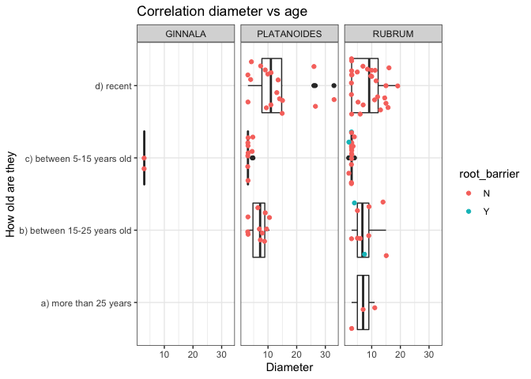

## Research question 4

For the last research question, I would like to see the distribution of
the trees regarding the `plant_area` in Kitsilano. `Plant_area` variable
has a classification as follows: B = behind sidewalk, G = in tree grate,
N = no sidewalk, and C = cutout. Specifically, I want to analyze how
many trees are cut out and see which street they are on.

First, I consider the whole data set vancouver\_trees and filter the
neighborhood `Kitsilano`and the `plant_area` “C” cutout trees.

    Cut_trees<-vancouver_trees %>%
      filter(plant_area %in% ("C")& neighbourhood_name %in% ("KITSILANO"))
    print(Cut_trees)

    ## # A tibble: 678 × 20
    ##    tree_id civic_number std_street genus_name species_name cultivar_name
    ##      <dbl>        <dbl> <chr>      <chr>      <chr>        <chr>        
    ##  1  157941         2324 W BROADWAY PYRUS      CALLERYANA   CHANTICLEER  
    ##  2  157953         2525 BALSAM ST  PYRUS      CALLERYANA   REDSPIRE     
    ##  3  157954         2525 BALSAM ST  PYRUS      CALLERYANA   REDSPIRE     
    ##  4  157958         2394 W BROADWAY PYRUS      CALLERYANA   CHANTICLEER  
    ##  5  157960         2404 W BROADWAY PYRUS      CALLERYANA   CHANTICLEER  
    ##  6  157961         2424 W BROADWAY PYRUS      CALLERYANA   REDSPIRE     
    ##  7  158016         2480 W BROADWAY PYRUS      CALLERYANA   REDSPIRE     
    ##  8  162950         2475 W BROADWAY CARPINUS   BETULUS      FASTIGIATA   
    ##  9  162969         2485 W BROADWAY CARPINUS   BETULUS      FASTIGIATA   
    ## 10  222037         2610 W 4TH AV   CARPINUS   BETULUS      FASTIGIATA   
    ## # … with 668 more rows, and 14 more variables: common_name <chr>,
    ## #   assigned <chr>, root_barrier <chr>, plant_area <chr>,
    ## #   on_street_block <dbl>, on_street <chr>, neighbourhood_name <chr>,
    ## #   street_side_name <chr>, height_range_id <dbl>, diameter <dbl>, curb <chr>,
    ## #   date_planted <date>, longitude <dbl>, latitude <dbl>

After this, using the group\_by, summarise, and count function, I got
the number of trees cut out for each street in Kitsilano. I arranged it
in descending order to know where I could find more cutout trees.

    observations_cut <- Cut_trees %>%
        group_by(on_street) %>%
        summarise(Count = n())%>%
      arrange(desc(Count))

    print(observations_cut)

    ## # A tibble: 24 × 2
    ##    on_street    Count
    ##    <chr>        <int>
    ##  1 W BROADWAY     316
    ##  2 W 4TH AV       176
    ##  3 BURRARD ST      43
    ##  4 ARBUTUS ST      32
    ##  5 YEW ST          22
    ##  6 W 1ST AV        13
    ##  7 MACDONALD ST    10
    ##  8 BALACLAVA ST     9
    ##  9 MACKENZIE ST     9
    ## 10 BAYSWATER ST     7
    ## # … with 14 more rows

Finally, I created a graph using latitude and longitude. Using the new
`higher_values` variable I just created, I highlight the trees of W
BROADWAY street. I used the geom\_point function and also changed its
alpha value.

    higher_values<-Cut_trees %>% 
                 filter(on_street=="W BROADWAY")
    higher_values

    ## # A tibble: 316 × 20
    ##    tree_id civic_number std_street genus_name species_name cultivar_name
    ##      <dbl>        <dbl> <chr>      <chr>      <chr>        <chr>        
    ##  1  157941         2324 W BROADWAY PYRUS      CALLERYANA   CHANTICLEER  
    ##  2  157953         2525 BALSAM ST  PYRUS      CALLERYANA   REDSPIRE     
    ##  3  157954         2525 BALSAM ST  PYRUS      CALLERYANA   REDSPIRE     
    ##  4  157958         2394 W BROADWAY PYRUS      CALLERYANA   CHANTICLEER  
    ##  5  157960         2404 W BROADWAY PYRUS      CALLERYANA   CHANTICLEER  
    ##  6  157961         2424 W BROADWAY PYRUS      CALLERYANA   REDSPIRE     
    ##  7  158016         2480 W BROADWAY PYRUS      CALLERYANA   REDSPIRE     
    ##  8  162950         2475 W BROADWAY CARPINUS   BETULUS      FASTIGIATA   
    ##  9  162969         2485 W BROADWAY CARPINUS   BETULUS      FASTIGIATA   
    ## 10  223147         3466 W BROADWAY MALUS      ZUMI         CALOCARPA    
    ## # … with 306 more rows, and 14 more variables: common_name <chr>,
    ## #   assigned <chr>, root_barrier <chr>, plant_area <chr>,
    ## #   on_street_block <dbl>, on_street <chr>, neighbourhood_name <chr>,
    ## #   street_side_name <chr>, height_range_id <dbl>, diameter <dbl>, curb <chr>,
    ## #   date_planted <date>, longitude <dbl>, latitude <dbl>

    Cut_trees %>%
    ggplot(aes(x=longitude, y=latitude)) + 
      geom_point(alpha=0.3) +
      geom_point(data=higher_values, 
                 aes(x=longitude, y=latitude, color=on_street),
                 size=1)

    ## Warning: Removed 119 rows containing missing values (geom_point).

    ## Warning: Removed 45 rows containing missing values (geom_point).

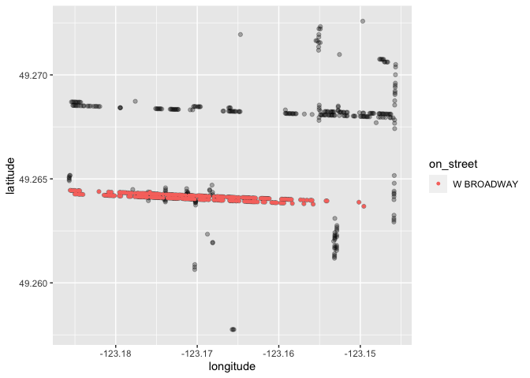

# Task 2: Tidy my data

In this task, I will do several exercises to reshape my data using the
`tidyr` package.

A reminder of the definition of *tidy* data:

-   Each row is an **observation**

-   Each column is a **variable**

-   Each cell is a **value**

*Tidy’ing* data is sometimes necessary because it can simplify
computation. Other times it can be nice to organize data so that it can
be easier to understand when read manually.

Based on the definition above and through all my columns, I can say that
my dataset **`vancouver_trees`** is tidy.

This dataset is a collection of **values**; some are numbers (if
quantitative, e.g., `diameter`) or strings (if qualitative, e.g.,
`plant_area`). In this case, every value belongs to a **variable** and
an **observation**. Each variable contains all values that measure the
same underlying attribute (like the
r`oot_barrier, the neighborhood, street` etc.) across units. Each
observation includes all values measured on the same unit; each tree has
its values across all the attributes.

I created a new tibble with 146,611 rows(observations = tree) and 8
colums (variables
t`ree_id, genus_name, height_range_id, root_barrier, neighbourhood_name, on_street, longitude, latitude`).

We can see that each row is a tree that was assigned to an ID. Each tree
is classified into its genus, which tells us whether it has a root
barrier or not. Moreover, we will know the street where it is as well as
its neighborhood; it tells us which is its height range that goes from 0
to 10 for every 10 feet (e.g., 0 = 0-10 ft, 1 = 10-20 ft, 2 = 20-30 ft,
and10 = 100+ ft) and finally we will observe its longitude and latitude.
All the column headers mustn’t be values; they are variable names.
Furthermore, there are no multiple variables stored in one column.

The only thing I can say I would change is which column goes first. In
this case, I placed first the variables `tree_id`, `genus_name`,
`height_range_id,` `root_barrier`, and then the variables regarding the
location, such as `neighbourhood_name`, `on_street`, `longitude,`
`latitude`.

    vancouver_trees %>%
      select(tree_id, genus_name, height_range_id, root_barrier, neighbourhood_name, on_street, longitude, latitude)

    ## # A tibble: 146,611 × 8
    ##    tree_id genus_name height_range_id root_barrier neighbourhood_name on_street 
    ##      <dbl> <chr>                <dbl> <chr>        <chr>              <chr>     
    ##  1  149556 ULMUS                    2 N            MARPOLE            W 58TH AV 
    ##  2  149563 ZELKOVA                  4 N            MARPOLE            W 58TH AV 
    ##  3  149579 STYRAX                   3 N            KENSINGTON-CEDAR … WINDSOR ST
    ##  4  149590 FRAXINUS                 4 N            KENSINGTON-CEDAR … E 39TH AV 
    ##  5  149604 ACER                     2 N            KENSINGTON-CEDAR … WINDSOR ST
    ##  6  149616 PYRUS                    2 N            MARPOLE            W 61ST AV 
    ##  7  149617 ACER                     3 N            KENSINGTON-CEDAR … SHERBROOK…
    ##  8  149618 ACER                     3 N            KENSINGTON-CEDAR … SHERBROOK…
    ##  9  149619 ACER                     2 N            KENSINGTON-CEDAR … SHERBROOK…
    ## 10  149625 FRAXINUS                 2 N            KENSINGTON-CEDAR … E 39TH AV 
    ## # … with 146,601 more rows, and 2 more variables: longitude <dbl>,
    ## #   latitude <dbl>

### Let’s untidy it!

Now, since my data is tidy I will untidy it. I will work only with the 8
columns I mentioned in 2.1.

**BEFORE**

I created a new tibble called `vancouver_trees_tidy,` which has 8
variables and 146,611 observations.

    vancouver_trees_tidy<-(vancouver_trees %>%
      select(tree_id, genus_name, height_range_id, root_barrier, longitude, latitude, neighbourhood_name, on_street))
    vancouver_trees_tidy

    ## # A tibble: 146,611 × 8
    ##    tree_id genus_name height_range_id root_barrier longitude latitude
    ##      <dbl> <chr>                <dbl> <chr>            <dbl>    <dbl>
    ##  1  149556 ULMUS                    2 N                -123.     49.2
    ##  2  149563 ZELKOVA                  4 N                -123.     49.2
    ##  3  149579 STYRAX                   3 N                -123.     49.2
    ##  4  149590 FRAXINUS                 4 N                -123.     49.2
    ##  5  149604 ACER                     2 N                -123.     49.2
    ##  6  149616 PYRUS                    2 N                -123.     49.2
    ##  7  149617 ACER                     3 N                -123.     49.2
    ##  8  149618 ACER                     3 N                -123.     49.2
    ##  9  149619 ACER                     2 N                -123.     49.2
    ## 10  149625 FRAXINUS                 2 N                -123.     49.2
    ## # … with 146,601 more rows, and 2 more variables: neighbourhood_name <chr>,
    ## #   on_street <chr>

**AFTER**

I will untidy it using the function pivot\_longer. In this case, I will
add two different columns. *`"Type of location"`* where the values could
be `neighborhood` or `street.` The other column is called “*`location`*”
where we can find the `streets` or the `neighborhoods`. This new tibble
is an untidy data set since multiple variables are stored in one column
(`neighorhoods` and `streets`). Now we have 293,222 observations which
makes the analysis more complicated.

    (vancouver_trees_untidy <- vancouver_trees_tidy %>% 
      pivot_longer(cols = c(neighbourhood_name, on_street), 
                   names_to= "type of location",
                   values_to = "location"))

    ## # A tibble: 293,222 × 8
    ##    tree_id genus_name height_range_id root_barrier longitude latitude
    ##      <dbl> <chr>                <dbl> <chr>            <dbl>    <dbl>
    ##  1  149556 ULMUS                    2 N                -123.     49.2
    ##  2  149556 ULMUS                    2 N                -123.     49.2
    ##  3  149563 ZELKOVA                  4 N                -123.     49.2
    ##  4  149563 ZELKOVA                  4 N                -123.     49.2
    ##  5  149579 STYRAX                   3 N                -123.     49.2
    ##  6  149579 STYRAX                   3 N                -123.     49.2
    ##  7  149590 FRAXINUS                 4 N                -123.     49.2
    ##  8  149590 FRAXINUS                 4 N                -123.     49.2
    ##  9  149604 ACER                     2 N                -123.     49.2
    ## 10  149604 ACER                     2 N                -123.     49.2
    ## # … with 293,212 more rows, and 2 more variables: type of location <chr>,
    ## #   location <chr>

And not I tidy it again, using the pivot\_wider function. As we can see
we have the first tibble with 146,611 observations.

    vancouver_trees_untidy %>% pivot_wider(names_from = "type of location", values_from = location)

    ## # A tibble: 146,611 × 8
    ##    tree_id genus_name height_range_id root_barrier longitude latitude
    ##      <dbl> <chr>                <dbl> <chr>            <dbl>    <dbl>
    ##  1  149556 ULMUS                    2 N                -123.     49.2
    ##  2  149563 ZELKOVA                  4 N                -123.     49.2
    ##  3  149579 STYRAX                   3 N                -123.     49.2
    ##  4  149590 FRAXINUS                 4 N                -123.     49.2
    ##  5  149604 ACER                     2 N                -123.     49.2
    ##  6  149616 PYRUS                    2 N                -123.     49.2
    ##  7  149617 ACER                     3 N                -123.     49.2
    ##  8  149618 ACER                     3 N                -123.     49.2
    ##  9  149619 ACER                     2 N                -123.     49.2
    ## 10  149625 FRAXINUS                 2 N                -123.     49.2
    ## # … with 146,601 more rows, and 2 more variables: neighbourhood_name <chr>,
    ## #   on_street <chr>

Now, I’m more familiar with my data, and also I have made progress in
answering my research questions. Based on my interest, and my analyses,
I pick 2 questions to continue my analysis in milestone 3:

**Research question 2**

Within the ACER genus, I would like to know if there is any relationship
between the species and the diameter? And also if there is a
relationship with the fact that some trees have a root barrier.

Perhaps some species of trees typically have a larger diameter. Since I
only focused on STRATHCONA Neighborhood.

**Research question 3**

Considering the results from `Research question 2,` I choose three
`species_names` and I analyze the relationship between the `diameter`and
the `date_planted`. The question I would like to answer is: can I find
any correlations between these two values? I hypothesize that if the
trees are older, the diameter would be larger.

These two questions are related and I would like to

-   drop some outliers (first understand if they are real outliers)

-   drop some irrelevant columns

-   filter the data of interest

-   use other type of graphs, (fit a linear regression model)

-   use Tidy Tibbles with broom

Looking forward to start my next milestone.
